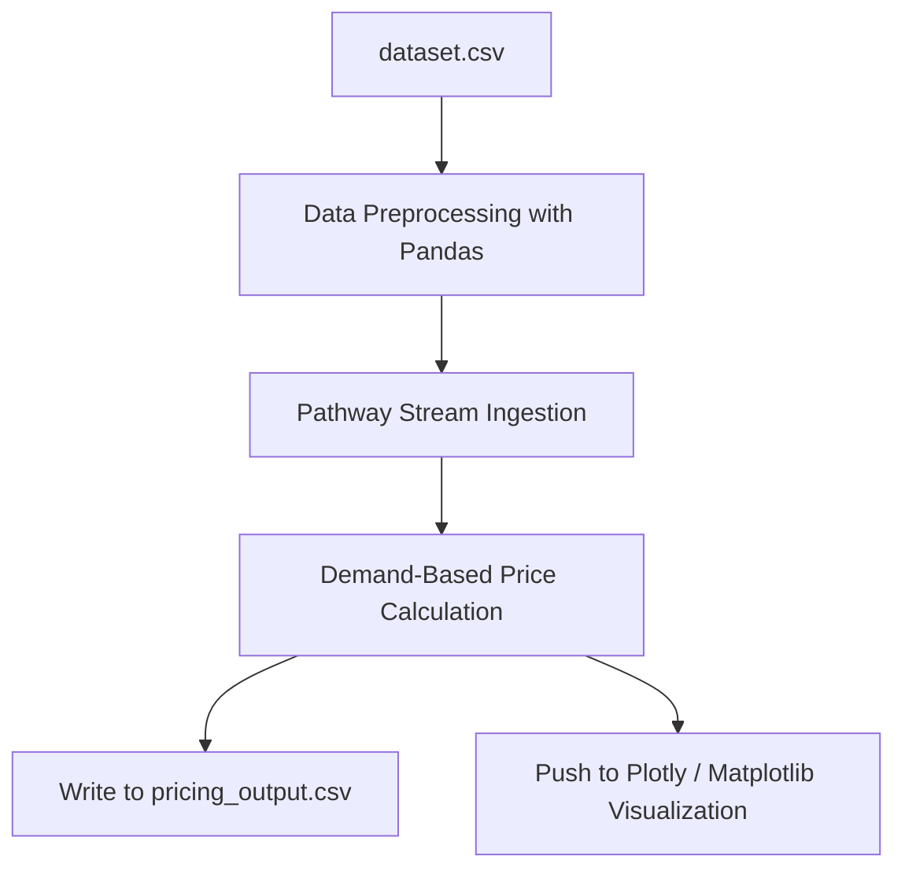

# Dynamic Pricing for Urban Parking Lots

## Project Overview

This project is part of the Summer Analytics 2025 Capstone, hosted by the Consulting & Analytics Club (CAC) in collaboration with Pathway. The objective is to develop an intelligent, real-time dynamic pricing model for 14 urban parking spaces using a simulated data stream.

The system is built using:

* Python (NumPy, Pandas)
* Pathway (for real-time stream processing)
* Bokeh / Plotly / Matplotlib (for visualization)

---

## Problem Statement

Static parking prices often lead to inefficiencies like overcrowding or underutilization. The aim of this project is to build a pricing engine that adapts in real-time based on:

* Parking occupancy
* Queue length
* Nearby traffic
* Special day indicators
* Type of vehicle
* Competitor parking lot prices (in the advanced model)

---

## Objectives

* Build three pricing models from scratch using Python.
* Simulate real-time data ingestion and price prediction using Pathway.
* Provide live and static visualizations of pricing behavior.
* Ensure pricing is stable, explainable, and responsive to demand and competition.

---

## Tech Stack

* **Programming Language:** Python
* **Libraries:** NumPy, Pandas, Matplotlib, Plotly, Bokeh
* **Real-Time Framework:** Pathway
* **Data Format:** CSV (stream simulated from static data)
* **Execution Environment:** Jupyter Notebook / Google Colab

---

## Architecture Overview

### Architecture Diagram (Mermaid Format)

### Workflow Explanation

1. Raw data is loaded from `dataset.csv`.
2. Data is preprocessed using Pandas.
3. Pathway simulates real-time stream ingestion using `table_from_pandas`.
4. Pricing logic (Model 2 - Demand Function) is applied on-the-fly.
5. Prices are written to `pricing_output.csv`.
6. Prices are visualized using Plotly (for live) and Matplotlib (for static) plots.

---

## Models Implemented

### Model 1: Baseline Linear Model

* Formula: Price(t+1) = Price(t) + alpha \* (Occupancy / Capacity)
* Acts as a simple benchmark model.

### Model 2: Demand-Based Pricing Model (Implemented)

* Formula:
  Demand = 0.5 \* (Occupancy / Capacity) +
  0.3 \* QueueLength -
  0.2 \* TrafficLevel +
  0.1 \* IsSpecialDay +
  0.05 \* VehicleTypeWeight

  Price = BasePrice \* (1 + 0.2 \* normalized\_demand)

* Dynamically adjusts prices based on real-world features.

### Model 3: Competitive Pricing Model (Planned)

* Will consider:

  * Geographic proximity of lots using coordinates
  * Nearby lot prices
  * Rerouting suggestions for full or expensive lots

---

## Visualizations

### Static Plots

* Matplotlib line plots for each parking lot
* Simulated real-time updates using IPython display and clear\_output

### Simulated Live Plot

* Plotly-based chart updating in a loop for 10 seconds
* Displays the latest 20 pricing data points

---

## Demand Function Explanation

The demand function is a linear combination of:

* Occupancy rate: Reflects current usage
* Queue length: Indicates pressure on the lot
* Traffic conditions: High traffic reduces demand
* Special day flag: Events or holidays increase demand
* Vehicle type: Trucks consume more space than bikes

Each component was weighted based on assumed real-world influence and scaled to a normalized value to avoid extreme price swings.

---

## Assumptions

* Base price is \$10
* Prices are bounded between \$10 and \$12 using normalization
* Vehicle weights:

  * Car = 1.0
  * Bike = 0.7
  * Truck = 1.5
* Traffic level:

  * Low = 1
  * Medium = 2
  * High = 3
* No use of external ML libraries, only NumPy and Pandas

---

## Real-Time System with Pathway

* Pathway ingests dataset using table\_from\_pandas
* Computes prices on-the-fly for each lot and timestamp
* Writes streaming results to pricing\_output.csv
* Visualized using live Plotly and Matplotlib scripts

---

## Submission Components

* `Dynamic_Pricing_Pathway_Final.ipynb`: Fully-commented Jupyter notebook
* `pricing_output.csv`: Output file for visualizations
* Inline and simulated real-time plots in notebook using Plotly and Matplotlib
* This report as `README.md`
* Optional: PDF version of this document for upload

---

## Repository Access Requirements

* Ensure your GitHub repository is set to **public**
* Or explicitly share repository access with reviewers
* All scripts and notebooks must run without errors in Google Colab or Jupyter

---

## Conclusion

We successfully built a real-time dynamic pricing engine that adjusts based on occupancy, queue, traffic, and vehicle type. The demand-based model (Model 2) provides stable and explainable price changes. Visualizations validate pricing behavior.

Planned enhancements include implementing Model 3 with competition-aware logic and integrating rerouting logic for full lots.

---

## Author

DAWLAGAR SIDDARTH , d.sidarth286@gmail.com
